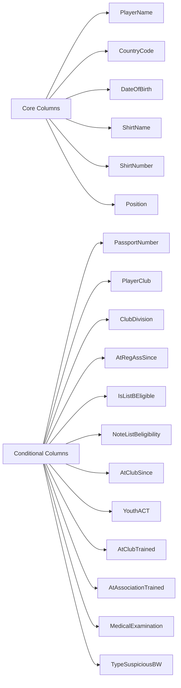
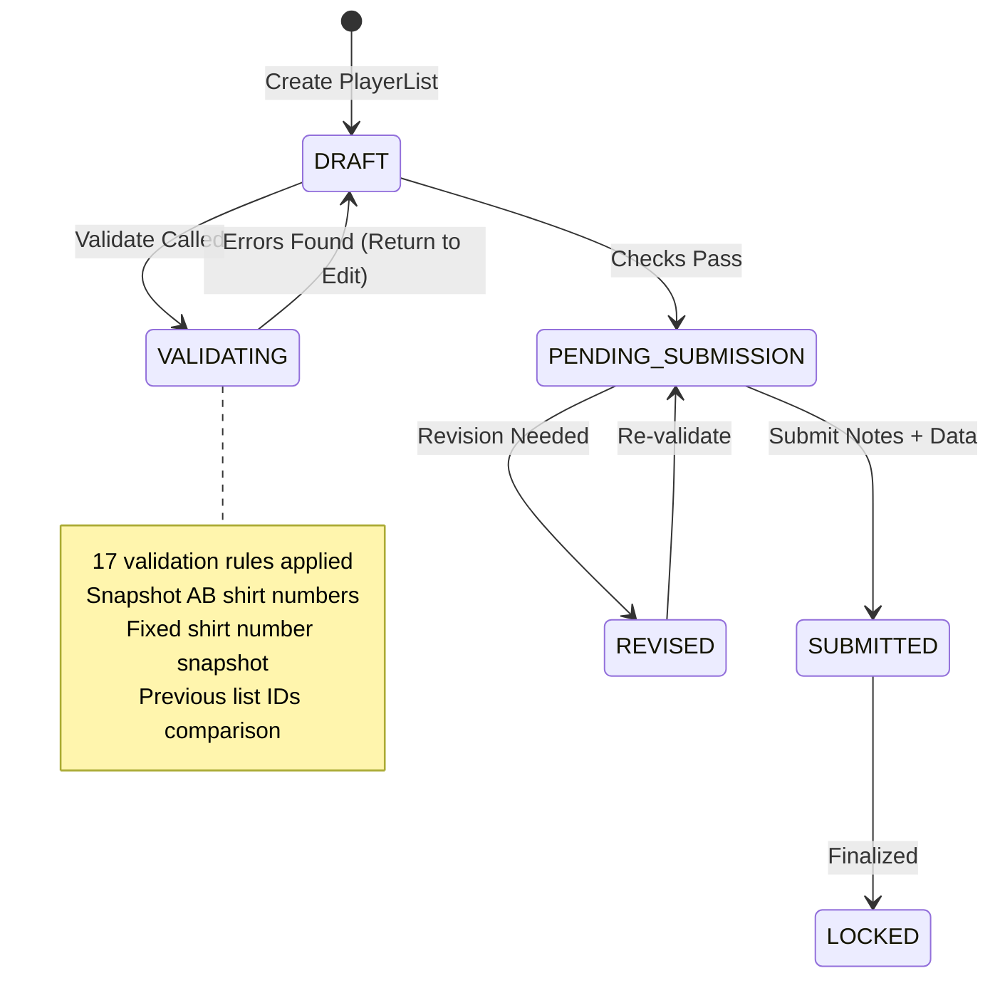
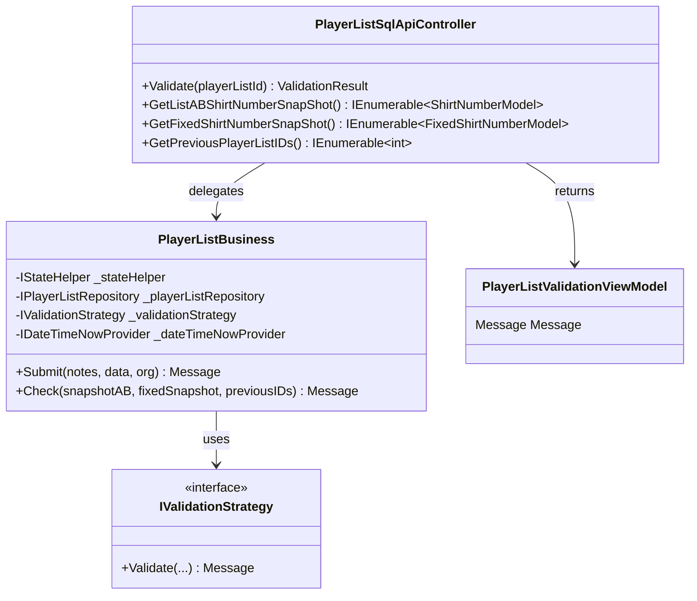
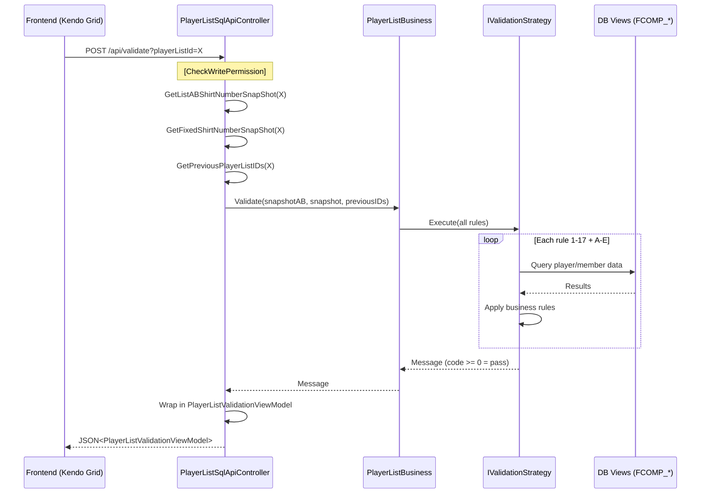
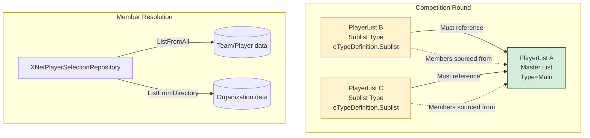
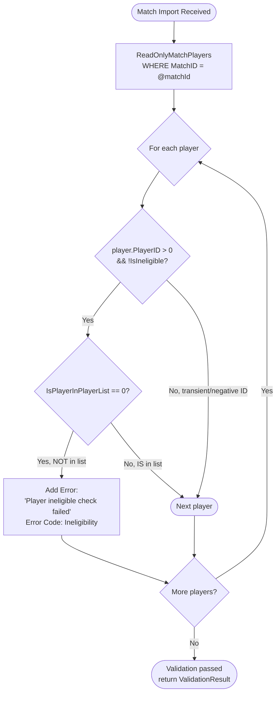
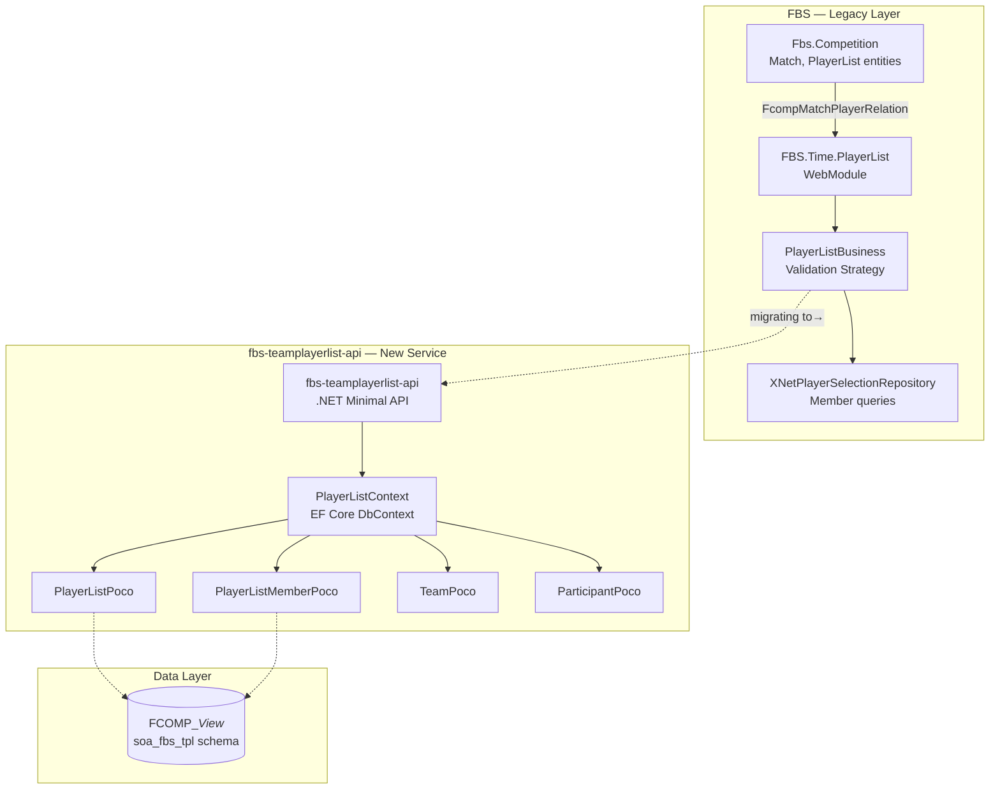
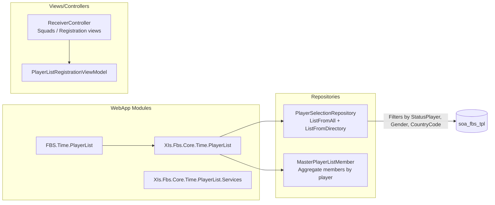

# PlayerList Resource — Extended Analysis

## Source

- **Codebase:** `UEFA\fame-football\FAME.Football\FBS` (FAME Football System)
- **Indexed Collection:** Qdrant `uefa_code`
- **Analysis Date:** 2026-07-31

---

## 1. Domain Overview

The **PlayerList** resource is a core domain concept in the UEFA FAME Football System (`FBS`) that manages team roster registration and validation across competitions, rounds, and teams. It supports:

- **Master player lists** — canonical rosters for a competition round
- **Sublists** — derived/secondary lists (e.g., squad, training) linked to a master list
- **National associations** vs. **club-based** player categorization
- **Gender-aware** filtering (Men/Women teams)
- **UEFA qualification rules** for coaching staff
- **Match eligibility validation** — ensuring players in a match appear on an approved list

---

## 2. Entity Model

### 2.1 Core Entities (from `fbs-teamplayerlist-api`)

```mermaid
erDiagram
    PlayerListPoco ||--o{ PlayerListMemberPoco : contains
    TeamPoco ||--o{ PlayerListPoco : "has"
    ParticipantPoco }|--|| TeamPoco : "registered as"

    PlayerListPoco {
        int PlayerListId PK
        int CompetitionId FK
        int CompetitionTypeId FK
        int RoundId FK
        int TeamId FK
    }

    PlayerListMemberPoco {
        int PlayerListMemberId PK
        int PlayerId FK
        int PlayerListId FK
        int StatusPlayerMember
        string StatusPlayerMemberName
        string LastName
        string FirstName
        DateTime DateOfBirth
        int CountryId
        string CountryName
        int TypeList
        int? NextMatch
    }

    TeamPoco {
        int TeamId PK
    }

    ParticipantPoco {
        int ParticipantId PK
        int TeamId FK
        int CompetitionId FK
        int RoundId FK
    }
```

### 2.2 Database Views (EF Core Mappings)

The API reads from **existing database views** in schema `soa_fbs_tpl`:

| View | Purpose |
|------|---------|
| `FCOMP_TeamView` | Team lookup |
| `FCOMP_PlayerListView` | PlayerList records |
| `FCOMP_PlayerListMemberView` | Member entries |
| `FCOMP_ParticipantRoundView` | Competition round participants |

### 2.3 Column Schema (Grid Display)

Dynamic columns from `ColumnsPlayerListHelper`:



---

## 3. PlayerList Lifecycle



### State Constants

| State | Code | Meaning |
|-------|------|---------|
| `DRAFT` | (implied) | Under construction |
| `STATUS_VALIDATION_PENDING` | 2 | Awaiting validation pass |
| `PENDING_SUBMISSION` | (implied) | Validated, ready to submit |
| `SUBMITTED` | (implied) | Notes saved, submitted for review |
| `LOCKED` | (implied) | Finalized — immutable |

---

## 4. Validation System Architecture

### 4.1 Strategy Pattern Implementation



### 4.2 The 17 Validation Rules

| # | Rule Name | Trigger / Check Method | Type |
|---|-----------|----------------------|------|
| 1 | Duplicate player check | Built-in list check | Error |
| 2 | Sublist → master list dependency | `TypeDefinition.Sublist` | Error |
| 3 | Round uniqueness constraint | Same round/team/type existing | Error |
| 4 | Shirt number required | `IsShirtNumbersRequired` | Error |
| 5 | Shirt number range enforcement | Configured min/max bounds | Error |
| 6 | Duplicate shirt numbers across A/B | `CheckTypeListABShirtNumbers` | Error |
| 7 | Over-age player count range | `HasRangeNumPlayersOverAge` → `CheckRangeNumPlayersOverAge` | Error |
| 8 | Fixed shirt number snapshot | `IsActiveFixedShirtNumberSnapshot` → `CheckFixedShirtNumbers` | Error |
| 9 | Changes-from-source limit | `HasRangeNumChangesFromSourcePL` → `CheckChangesFromSource` | Error |
| 10 | Shirt name required | `IsShirtNameRequired` | Error |
| 11 | Position required | `IsPositionRequired` | Error |
| 12 | Futsal position restriction | `IsFutsal` — midfield blocked | Error |
| 13 | Club since date required | `IsClubSinceRequired` | Error |
| 14 | Player club required | `IsClubNameRequired` | Error |
| 15 | Club division required | `IsClubDivisionRequired` | Error |
| 16 | Association registration date required | `IsAtRegAssSinceRequired` | Error |
| 17 | Staff rules (role, coach count, qualifications) | `FlagsBW.HasStaffManagement` | Error / Warning |

### 4.3 Warning Rules (Non-Blocking)

| # | Rule Name | Trigger | Notes |
|---|-----------|---------|-------|
| A | Head coach UEFA qualification | `HasHeadCoachMinimumQualification` | Warning only |
| B | Female head/assistant coach rule | `IsFemaleHeadCoachOrAssistant` | Diploma threshold check |
| C | Assistant coach UEFA qualification | `HasAssistantCoachMinimumQualification` | Warning |
| D | List B eligibility validation | `IsClubSinceRequired && HasListBEligibility` → `CheckListBEligibility` | Per-player eligibility window |
| E | Missing signed document | Non-COVID lists without upload | Warning |

---

## 5. Data Flow — Validation Endpoint



---

## 6. Master ↔ Sublist Hierarchy



**Key rule:** A sublist cannot exist without an associated master list for the same round and playerlist type.

---

## 7. Match Eligibility Check

### `CheckPlayerInPlayerList` — Match Import Validator



This check runs in the **FSP Instant Import** module (`FspImport.Application`) during match data import, ensuring every active player appearing in a match has an approved PlayerList entry.

---

## 8. Module Architecture



The system is in a **migration phase** — the new `fbs-teamplayerlist-api` reads from database views (EF Core read-only) as a transition path from the legacy `XNet` repository pattern.

---

## 9. Time Integration Module

The **FBS.Time.PlayerList** module handles player registration timing workflows:



**Filtering pipeline in `ListFromDirectory`:**
1. Set `StatusPlayer = Active`
2. Set `Gender` based on team (M/F)
3. Apply Kendo Grid filters dynamically
4. Set `TypeService = AATACTValidation`
5. Add `OrganizationID`, `TargetPlayerListID` context
6. Filter by `CountryCode` for national associations
7. Apply pagination via `QueryOptions`

---

## 10. File Index (Key Sources)

| File | Role |
|------|------|
| `FBS/WebApp/Modules/FBS.Time.PlayerList/.../PlayerListPageBase.cs` | Page base with new-list validation checks |
| `FBS/.../FBS.Time.PlayerList.Http/Controllers/Api/PlayerListSqlApiController.cs` | REST API entry — Validate, Submit |
| `FBS/.../FBS.Time.PlayerList.Business/PlayerListBusiness.cs` | Core validation orchestrator (Strategy Pattern) |
| `FBS/.../XNetPlayerSelectionRepository.cs` | Member data queries (`ListFromAll`, `ListFromDirectory`) |
| `FBS/.../FcompMatchPlayerRelation.cs` | Match ↔ PlayerList relationship check |
| `fbs-teamplayerlist-api/.../PlayerListContext.cs` | EF Core DbContext for new API |
| `fbs-teamplayerlist-api/.../PlayerListMemberPoco.cs` | Member entity with extended fields |
| `FSP-Instant-Import/.../ToBeValidatedExecutor.cs` | Match import eligibility checker |
| `football-data/.../MatchingPlayerPoco.cs` | Cross-provider player matching |
| `fame-football/FAME.Football/FBS/.../ColumnsPlayerListHelper.cs` | Dynamic grid column configuration (18 columns) |
| `football-architecture-diagrams/analysis/player-registration/` | Confluence docs (requirements, validation rules, data model) |

---

## 11. Summary

The PlayerList resource is a **complex, multi-layered domain** spanning:

- **Legacy ASP.NET WebForms modules** (`FBS.Time.PlayerList`) with Kendo Grid frontends
- **A new .NET minimal API** (`fbs-teamplayerlist-api`) in progress
- **17+ validation rules** driven by competition-specific flags
- **Master/sublist hierarchy** for squad composition
- **Match import integration** enforcing eligibility at match time
- **Dynamic column rendering** based on competition requirements
- **Staff qualification tracking** (UEFA diploma thresholds)
- **Gender-aware business rules** (Women's football specific)

The system represents a typical **enterprise migration pattern**: legacy monolith → modular API, read-only DB views as the bridge, with validation logic extracted into strategy interfaces.
